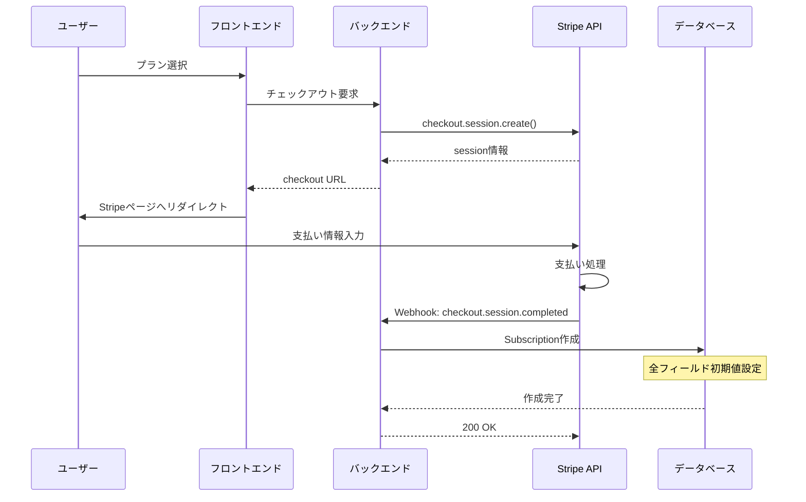
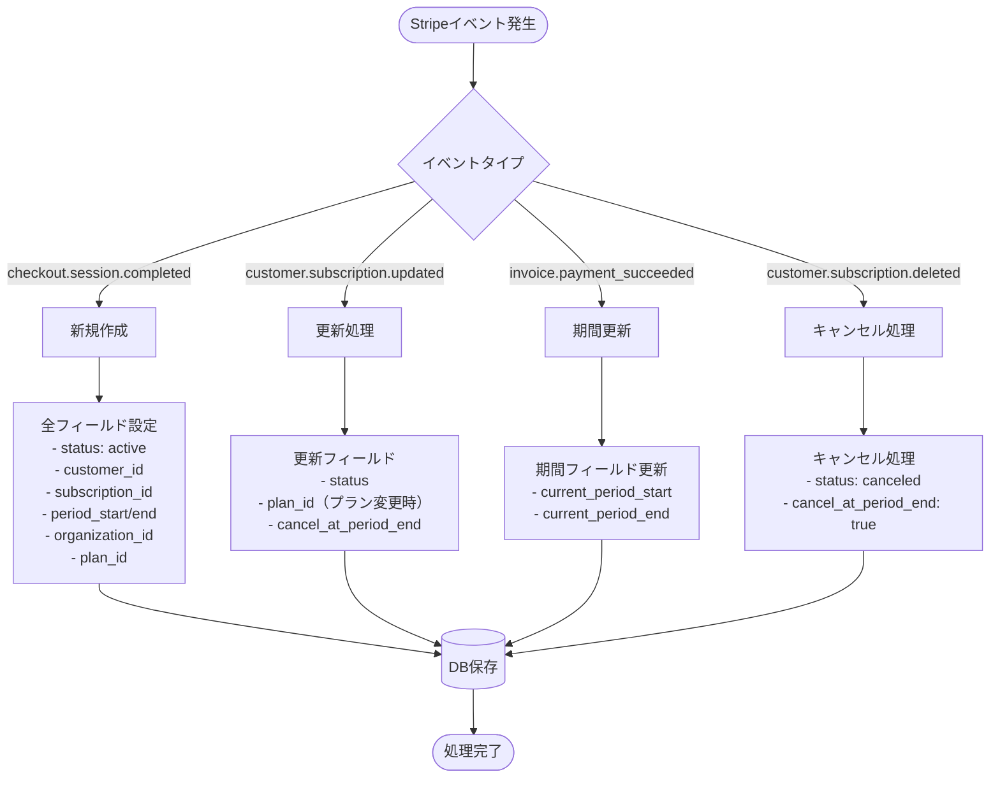
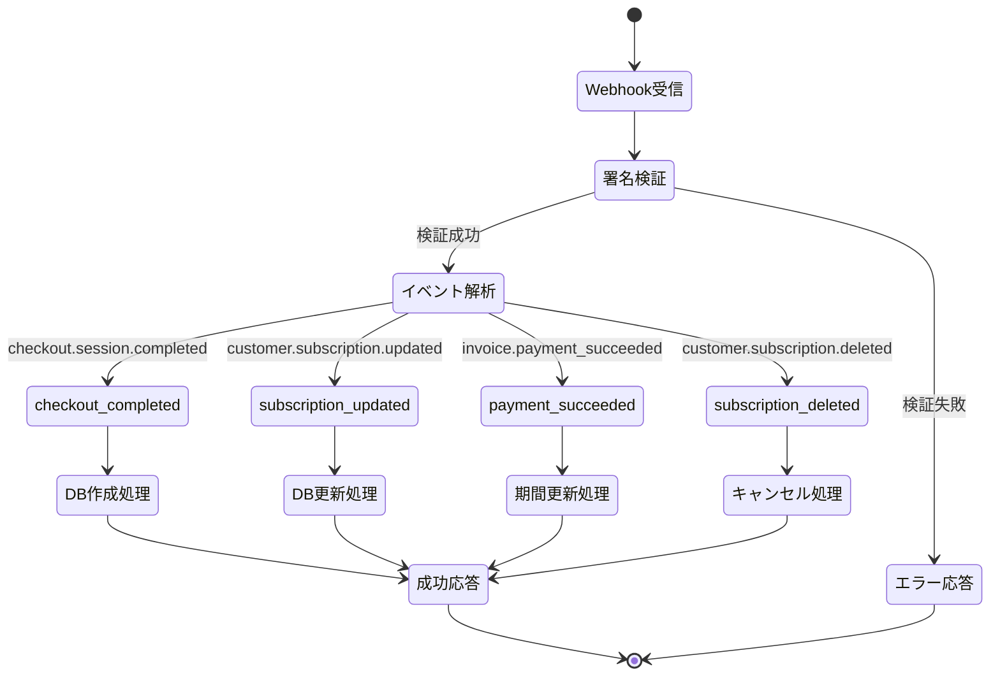
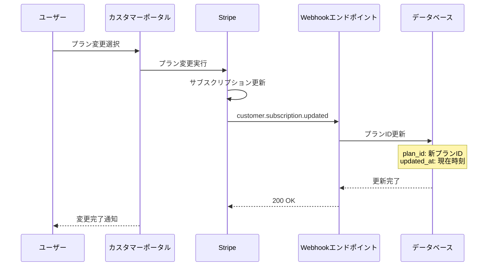

# Stripe Subscription 統合資料

## 📋 目次
1. [Subscriptionテーブル構造](#subscriptionテーブル構造)
2. [データ作成・更新タイミング](#データ作成更新タイミング)
3. [Webhookイベントフロー](#webhookイベントフロー)
4. [実装済みテスト環境](#実装済みテスト環境)
5. [トラブルシューティング](#トラブルシューティング)

---

## Subscriptionテーブル構造

### 📊 フィールド定義

| フィールド名 | 型 | 説明 | 作成タイミング |
|------------|---|-----|-------------|
| `id` | UUID | 主キー | レコード作成時（自動生成） |
| `status` | VARCHAR | サブスクリプション状態 | checkout完了時 |
| `stripe_customer_id` | VARCHAR | Stripe顧客ID | checkout完了時 |
| `stripe_subscription_id` | VARCHAR | StripeサブスクリプションID | checkout完了時 |
| `current_period_start` | DATETIME | 現在の請求期間開始 | checkout完了時 |
| `current_period_end` | DATETIME | 現在の請求期間終了 | checkout完了時 |
| `cancel_at_period_end` | BOOLEAN | 期間終了時のキャンセルフラグ | checkout完了時（デフォルト: False） |
| `created_at` | DATETIME | レコード作成日時 | レコード作成時（自動） |
| `updated_at` | DATETIME | レコード更新日時 | 更新時（自動） |
| `organization_id` | UUID | 組織ID（外部キー） | checkout完了時 |
| `plan_id` | UUID | プランID（外部キー） | checkout完了時 |

### 📈 ステータス値

- `active` - アクティブ
- `past_due` - 支払い遅延
- `canceled` - キャンセル済み
- `unpaid` - 未払い
- `trialing` - トライアル中
- `incomplete` - 不完全
- `incomplete_expired` - 不完全期限切れ

---

## データ作成・更新タイミング

### 🆕 初回作成フロー



### 🔄 更新フロー



---

## Webhookイベントフロー

### 📮 主要イベント処理



### 🔄 プラン変更フロー



---

## 実装済みテスト環境

### ✅ 動作確認済み

#### 1. **シンプルWebhookテスト**
```bash
# 基本機能テスト（4/4成功）
docker-compose exec django python simple_webhook_test.py
```

**テスト内容:**
- Stripe API接続
- Webhook署名検証
- オブジェクト作成（顧客、製品、価格、チェックアウト）
- イベントシミュレーション

#### 2. **テスト用Webhookサーバー**
```python
# Docker内で実行
docker-compose exec django python -c "
from http.server import HTTPServer, BaseHTTPRequestHandler
import json

class WebhookHandler(BaseHTTPRequestHandler):
    def do_POST(self):
        content_length = int(self.headers.get('Content-Length', 0))
        body = self.rfile.read(content_length).decode('utf-8')
        print(f'📨 Webhook受信: {self.path}')
        print(f'   データ: {body}')
        self.send_response(200)
        self.send_header('Content-Type', 'application/json')
        self.end_headers()
        self.wfile.write(b'{\"received\": true}')

HTTPServer(('0.0.0.0', 8000), WebhookHandler).serve_forever()
"
```

### ⚠️ 修正が必要

- Django管理画面エラー（admin設定の問題）
- ngrok設定ファイルエラー（YAML形式）
- 自動化スクリプト（Django依存）

---

## トラブルシューティング

### 🔧 よくあるエラーと対処法

#### 1. **Admin設定エラー**
```
LookupError: No installed app with label 'admin'
```
**対処法**: テスト環境では管理画面を使用しない設定を使用

#### 2. **ngrok設定エラー**
```
ERROR: YAML parsing error
```
**対処法**: ngrok設定ファイルを削除して再設定
```bash
rm "/Users/yamamoto/Library/Application Support/ngrok/ngrok.yml"
ngrok config add-authtoken YOUR_TOKEN
```

#### 3. **データベース接続エラー**
```
django.db.utils.OperationalError: Can't connect to MySQL
```
**対処法**: テスト環境ではSQLiteを使用

### 📝 環境変数設定

`.env.test`ファイルに必要な設定:
```env
# Stripe Test Keys
STRIPE_PUBLISHABLE_KEY=pk_test_xxxxx
STRIPE_SECRET_KEY=sk_test_xxxxx
STRIPE_WEBHOOK_SECRET=whsec_xxxxx

# Django設定
DJANGO_SECRET_KEY=test-secret-key
DEBUG=True

# Database（テスト用）
DATABASE_URL=sqlite:///db_test.sqlite3
```

---

## 🎯 推奨される実装手順

1. **開発環境でのテスト**
   - `simple_webhook_test.py`で基本機能確認
   - ngrok + シンプルサーバーでWebhook受信テスト

2. **Stripeダッシュボード設定**
   - Webhookエンドポイント登録
   - イベントタイプ選択
   - 署名シークレット取得

3. **本番環境への適用**
   - 環境変数設定
   - HTTPS対応
   - エラーログ監視

---

## 📊 フィールド別更新タイミング詳細

### 初回作成時（checkout.session.completed）

| フィールド | 値の例 | 取得元 |
|----------|-------|--------|
| `id` | UUID自動生成 | Django |
| `status` | `"active"` | Stripe subscription.status |
| `stripe_customer_id` | `"cus_xxxxx"` | session.customer |
| `stripe_subscription_id` | `"sub_xxxxx"` | session.subscription |
| `current_period_start` | `2024-01-01 00:00:00` | subscription.current_period_start |
| `current_period_end` | `2024-02-01 00:00:00` | subscription.current_period_end |
| `cancel_at_period_end` | `False` | subscription.cancel_at_period_end |
| `created_at` | 現在時刻 | Django自動 |
| `updated_at` | 現在時刻 | Django自動 |
| `organization_id` | 組織ID | session.metadata |
| `plan_id` | プランID | session.metadata |

### 更新時（各Webhookイベント）

| イベント | 更新フィールド | 更新内容 |
|---------|-------------|---------|
| `customer.subscription.updated` | status, plan_id, cancel_at_period_end | Stripeの値と同期 |
| `invoice.payment_succeeded` | current_period_start, current_period_end | 新しい請求期間 |
| `customer.subscription.deleted` | status, cancel_at_period_end | キャンセル状態に更新 |

---

この資料により、Stripeサブスクリプションの実装とテストの全体像が把握できます。