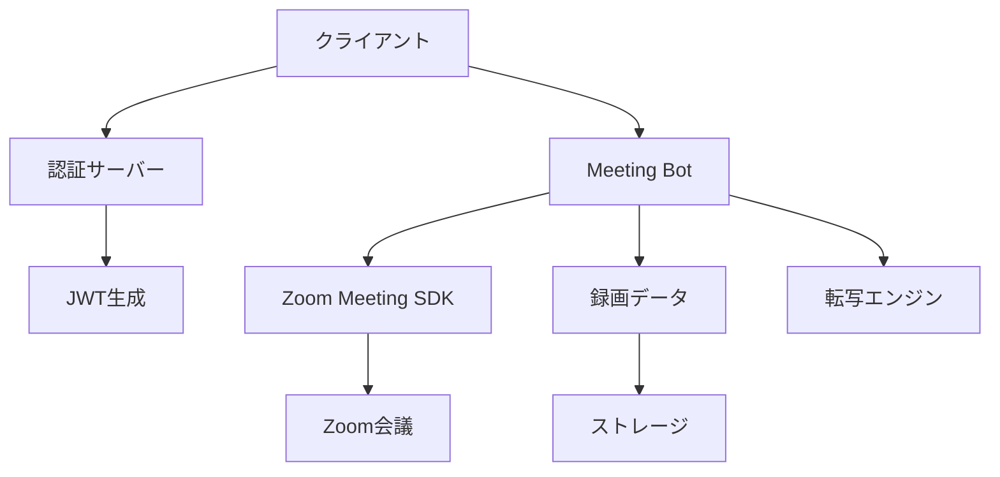

# Zoom Meeting Bot 実装ガイド

このガイドでは、Zoom Meeting SDKを使用して会議録画ボットを実装する方法を詳しく説明します。

## 目次

1. [概要](#概要)
2. [前提条件](#前提条件)
3. [アーキテクチャ](#アーキテクチャ)
4. [実装方法](#実装方法)
5. [Linux SDK実装](#linux-sdk実装)
6. [Web SDK実装](#web-sdk実装)
7. [トラブルシューティング](#トラブルシューティング)
8. [セキュリティ考慮事項](#セキュリティ考慮事項)

## 概要

Zoom Meeting Botは、会議に自動参加して録画・転写を行うシステムです。公式SDKを使用することで、安定した録画機能を実現できます。

### 主な機能
- 会議への自動参加
- 音声・映像の録画
- リアルタイム転写
- 参加者情報の取得

### 技術スタック
- **バックエンド**: Node.js, Express
- **認証**: JWT (JSON Web Token)
- **SDK**: Zoom Meeting SDK (Linux/Web)
- **データ保存**: ローカルストレージ/クラウドストレージ

## 前提条件

### 必要なアカウント・資格
1. **Zoom開発者アカウント**
   - [Zoom App Marketplace](https://marketplace.zoom.us/)でアカウント作成
   - Meeting SDK Appの作成

2. **Zoom Pro以上のライセンス**
   - 録画機能使用のため必須
   - クラウド録画の場合は追加ストレージ考慮

3. **開発環境**
   - Node.js 16以上
   - Linux環境（Linux SDK使用時）
   - Docker（推奨）

### SDK認証情報の取得
1. Zoom App Marketplaceにログイン
2. "Build App" → "Meeting SDK"を選択
3. 以下の情報を取得：
   - SDK Key (Client ID)
   - SDK Secret (Client Secret)

## アーキテクチャ



### コンポーネント説明

1. **認証サーバー**
   - JWT署名の生成
   - SDK認証情報の管理
   - セキュアなトークン配信

2. **Meeting Bot**
   - 会議参加ロジック
   - 録画制御
   - データ処理

3. **Zoom Meeting SDK**
   - Zoom APIとの通信
   - メディアストリーム処理
   - イベント処理

## 実装方法

### プロジェクト構造

```
zoom-meeting-bot/
├── src/
│   ├── auth/
│   │   └── jwtGenerator.js
│   ├── bot/
│   │   ├── meetingBot.js
│   │   └── recordingManager.js
│   ├── config/
│   │   └── zoomConfig.js
│   ├── linux-sdk/
│   │   └── linuxBot.js
│   └── web-sdk/
│       └── webBot.js
├── docker/
│   ├── Dockerfile
│   └── docker-compose.yml
├── .env.example
├── package.json
└── README.md
```

### 1. 環境設定

```bash
# .env
ZOOM_MEETING_SDK_KEY=your_sdk_key_here
ZOOM_MEETING_SDK_SECRET=your_sdk_secret_here
PORT=4000
NODE_ENV=development
RECORDING_PATH=/recordings
```

### 2. JWT生成サーバー

```javascript
// src/auth/jwtGenerator.js
const jwt = require('jsonwebtoken');
const crypto = require('crypto');

class ZoomJWTGenerator {
    constructor(sdkKey, sdkSecret) {
        this.sdkKey = sdkKey;
        this.sdkSecret = sdkSecret;
    }

    generateJWT(meetingNumber, role = 0) {
        const iat = Math.round(new Date().getTime() / 1000) - 30;
        const exp = iat + 60 * 60 * 2; // 2時間
        const tokenExp = iat + 60 * 60 * 2;

        const payload = {
            iss: this.sdkKey,
            appKey: this.sdkKey,
            iat: iat,
            exp: exp,
            tokenExp: tokenExp,
        };

        // Web SDKの場合は追加フィールドが必要
        if (meetingNumber) {
            payload.mn = meetingNumber;
            payload.role = role;
        }

        return jwt.sign(payload, this.sdkSecret, {
            algorithm: 'HS256',
            header: {
                alg: 'HS256',
                typ: 'JWT'
            }
        });
    }
}

module.exports = ZoomJWTGenerator;
```

### 3. Express認証サーバー

```javascript
// src/server.js
const express = require('express');
const cors = require('cors');
const ZoomJWTGenerator = require('./auth/jwtGenerator');
require('dotenv').config();

const app = express();
const PORT = process.env.PORT || 4000;

// ミドルウェア
app.use(cors());
app.use(express.json());

// JWT生成器
const jwtGenerator = new ZoomJWTGenerator(
    process.env.ZOOM_MEETING_SDK_KEY,
    process.env.ZOOM_MEETING_SDK_SECRET
);

// エンドポイント
app.post('/api/zoom/jwt', (req, res) => {
    try {
        const { meetingNumber, role = 0 } = req.body;
        
        if (!meetingNumber) {
            return res.status(400).json({
                error: 'Meeting number is required'
            });
        }

        const token = jwtGenerator.generateJWT(meetingNumber, role);
        
        res.json({
            success: true,
            token,
            sdkKey: process.env.ZOOM_MEETING_SDK_KEY
        });
        
    } catch (error) {
        console.error('JWT generation error:', error);
        res.status(500).json({
            error: 'Failed to generate JWT token'
        });
    }
});

app.listen(PORT, () => {
    console.log(`Server running on port ${PORT}`);
});
```

## Linux SDK実装

### 1. 環境準備

```bash
# Ubuntu/Debian
sudo apt-get update
sudo apt-get install -y \
    build-essential \
    cmake \
    pkg-config \
    libssl-dev \
    libcurl4-openssl-dev \
    libpulse-dev \
    libasound2-dev

# CentOS/RHEL
sudo yum install -y \
    gcc-c++ \
    cmake \
    openssl-devel \
    libcurl-devel \
    pulseaudio-libs-devel \
    alsa-lib-devel
```

### 2. SDK設定

```bash
# SDKダウンロード後
cd zoom-meeting-sdk-linux_x86_64
ln -s libmeetingsdk.so libmeetingsdk.so.1

# ヘッドレス環境用設定
mkdir -p ~/.config.us
cat > ~/.config.us/zoomus.conf << EOF
[General]
enable_headless=true
EOF
```

### 3. Linux Bot実装

```cpp
// src/linux-sdk/linuxBot.cpp
#include "zoom_sdk.h"
#include "meeting_service_interface.h"
#include "auth_service_interface.h"

class LinuxMeetingBot : public IAuthServiceEvent, 
                       public IMeetingServiceEvent {
private:
    ZOOM_SDK_NAMESPACE::IAuthService* authService;
    ZOOM_SDK_NAMESPACE::IMeetingService* meetingService;
    std::string jwtToken;
    
public:
    LinuxMeetingBot() {
        // SDK初期化
        ZOOM_SDK_NAMESPACE::InitParam initParam;
        initParam.strWebDomain = "https://zoom.us";
        initParam.strSupportUrl = "https://zoom.us";
        
        ZOOM_SDK_NAMESPACE::SDKError err = 
            ZOOM_SDK_NAMESPACE::InitSDK(initParam);
            
        if (err != ZOOM_SDK_NAMESPACE::SDKERR_SUCCESS) {
            throw std::runtime_error("SDK initialization failed");
        }
    }
    
    void authenticate(const std::string& jwt) {
        jwtToken = jwt;
        authService = ZOOM_SDK_NAMESPACE::CreateAuthService();
        authService->SetEvent(this);
        
        ZOOM_SDK_NAMESPACE::AuthContext authContext;
        authContext.jwt_token = jwtToken.c_str();
        
        authService->SDKAuth(authContext);
    }
    
    void joinMeeting(const std::string& meetingNumber, 
                     const std::string& password,
                     const std::string& userName) {
        meetingService = ZOOM_SDK_NAMESPACE::CreateMeetingService();
        meetingService->SetEvent(this);
        
        ZOOM_SDK_NAMESPACE::JoinParam joinParam;
        joinParam.userType = ZOOM_SDK_NAMESPACE::SDK_UT_WITHOUT_LOGIN;
        
        ZOOM_SDK_NAMESPACE::JoinParam4WithoutLogin& withoutLogin = 
            joinParam.param.withoutloginParam;
            
        withoutLogin.meetingNumber = std::stoull(meetingNumber);
        withoutLogin.vanityID = nullptr;
        withoutLogin.userName = userName.c_str();
        withoutLogin.psw = password.c_str();
        
        meetingService->Join(joinParam);
    }
    
    // 録画開始
    void startRecording() {
        auto recordingCtrl = meetingService->GetMeetingRecordingController();
        if (recordingCtrl) {
            recordingCtrl->StartRawRecording();
        }
    }
    
    // イベントハンドラ
    virtual void onAuthenticationReturn(AuthResult ret) override {
        if (ret == AUTHRET_SUCCESS) {
            std::cout << "Authentication successful" << std::endl;
        } else {
            std::cerr << "Authentication failed: " << ret << std::endl;
        }
    }
    
    virtual void onMeetingStatusChanged(MeetingStatus status, 
                                       int iResult = 0) override {
        switch(status) {
            case MEETING_STATUS_CONNECTING:
                std::cout << "Connecting to meeting..." << std::endl;
                break;
            case MEETING_STATUS_INMEETING:
                std::cout << "In meeting" << std::endl;
                startRecording();
                break;
            case MEETING_STATUS_ENDED:
                std::cout << "Meeting ended" << std::endl;
                break;
        }
    }
};
```

### 4. Node.js バインディング

```javascript
// src/linux-sdk/linuxBot.js
const { spawn } = require('child_process');
const path = require('path');

class LinuxSDKBot {
    constructor() {
        this.botProcess = null;
        this.isRunning = false;
    }

    async joinMeeting(config) {
        const { meetingNumber, password, userName, jwtToken } = config;
        
        // C++実行ファイルを起動
        const botPath = path.join(__dirname, 'build', 'zoom-bot');
        
        this.botProcess = spawn(botPath, [
            '--meeting', meetingNumber,
            '--password', password || '',
            '--name', userName || 'Recording Bot',
            '--jwt', jwtToken
        ]);
        
        return new Promise((resolve, reject) => {
            this.botProcess.stdout.on('data', (data) => {
                const message = data.toString();
                console.log('Bot output:', message);
                
                if (message.includes('In meeting')) {
                    this.isRunning = true;
                    resolve({ success: true });
                }
            });
            
            this.botProcess.stderr.on('data', (data) => {
                console.error('Bot error:', data.toString());
            });
            
            this.botProcess.on('error', (error) => {
                reject(error);
            });
        });
    }
    
    async leaveMeeting() {
        if (this.botProcess) {
            this.botProcess.kill('SIGTERM');
            this.isRunning = false;
        }
    }
}

module.exports = LinuxSDKBot;
```

## Web SDK実装

### 1. HTML基本構造

```html
<!-- public/index.html -->
<!DOCTYPE html>
<html>
<head>
    <title>Zoom Meeting Bot</title>
    <link type="text/css" rel="stylesheet" 
          href="https://source.zoom.us/2.18.0/css/bootstrap.css" />
    <link type="text/css" rel="stylesheet" 
          href="https://source.zoom.us/2.18.0/css/react-select.css" />
</head>
<body>
    <div id="zmmtg-root"></div>
    <div id="aria-notify-area"></div>
    
    <script src="https://source.zoom.us/2.18.0/lib/vendor/react.min.js"></script>
    <script src="https://source.zoom.us/2.18.0/lib/vendor/react-dom.min.js"></script>
    <script src="https://source.zoom.us/2.18.0/lib/vendor/redux.min.js"></script>
    <script src="https://source.zoom.us/2.18.0/lib/vendor/redux-thunk.min.js"></script>
    <script src="https://source.zoom.us/2.18.0/lib/vendor/lodash.min.js"></script>
    <script src="https://source.zoom.us/zoom-meeting-2.18.0.min.js"></script>
    <script src="js/webBot.js"></script>
</body>
</html>
```

### 2. Web SDK Bot実装

```javascript
// src/web-sdk/webBot.js
class ZoomWebBot {
    constructor() {
        this.client = ZoomMtgEmbedded.createClient();
        this.isInMeeting = false;
        this.mediaStream = null;
    }

    async initialize(containerId = 'zmmtg-root') {
        const meetingSDKElement = document.getElementById(containerId);
        
        await this.client.init({
            zoomAppRoot: meetingSDKElement,
            language: 'en-US',
            patchJsMedia: true,
            leaveOnPageUnload: true
        });
        
        console.log('Zoom Web SDK initialized');
    }

    async joinMeeting(config) {
        const {
            signature,
            sdkKey,
            meetingNumber,
            password,
            userName
        } = config;

        try {
            await this.client.join({
                signature: signature,
                sdkKey: sdkKey,
                meetingNumber: meetingNumber,
                password: password,
                userName: userName,
                userEmail: '',
                tk: '', // 登録が必要な場合のトークン
                zak: '' // ホストの場合のZAK
            });

            this.isInMeeting = true;
            console.log('Successfully joined meeting');
            
            // イベントリスナー設定
            this.setupEventListeners();
            
            // 録画権限リクエスト
            setTimeout(() => {
                this.requestRecordingPermission();
            }, 3000);
            
        } catch (error) {
            console.error('Failed to join meeting:', error);
            throw error;
        }
    }

    setupEventListeners() {
        // 参加者イベント
        this.client.on('user-added', (payload) => {
            console.log('User joined:', payload);
        });

        this.client.on('user-removed', (payload) => {
            console.log('User left:', payload);
        });

        // 音声イベント
        this.client.on('audio-change', (payload) => {
            console.log('Audio change:', payload);
        });

        // 会議終了イベント
        this.client.on('meeting-ended', (payload) => {
            console.log('Meeting ended');
            this.cleanup();
        });
    }

    async requestRecordingPermission() {
        try {
            // 録画権限リクエスト
            const recordingClient = this.client.getRecordingClient();
            
            if (recordingClient) {
                await recordingClient.askHostToRecord();
                console.log('Recording permission requested');
            }
        } catch (error) {
            console.error('Failed to request recording:', error);
        }
    }

    async startLocalRecording() {
        try {
            // ブラウザのMediaRecorder APIを使用
            const stream = await this.captureMediaStream();
            
            const mediaRecorder = new MediaRecorder(stream, {
                mimeType: 'video/webm;codecs=vp9,opus'
            });

            const recordedChunks = [];

            mediaRecorder.ondataavailable = (event) => {
                if (event.data.size > 0) {
                    recordedChunks.push(event.data);
                }
            };

            mediaRecorder.onstop = () => {
                const blob = new Blob(recordedChunks, {
                    type: 'video/webm'
                });
                this.saveRecording(blob);
            };

            mediaRecorder.start(1000); // 1秒ごとにデータ取得
            this.mediaRecorder = mediaRecorder;
            
            console.log('Local recording started');
            
        } catch (error) {
            console.error('Failed to start local recording:', error);
        }
    }

    async captureMediaStream() {
        // 画面共有のキャプチャ
        const displayStream = await navigator.mediaDevices.getDisplayMedia({
            video: {
                width: { ideal: 1920 },
                height: { ideal: 1080 },
                frameRate: { ideal: 30 }
            },
            audio: true
        });

        return displayStream;
    }

    saveRecording(blob) {
        const url = URL.createObjectURL(blob);
        const a = document.createElement('a');
        a.style.display = 'none';
        a.href = url;
        a.download = `zoom-recording-${Date.now()}.webm`;
        document.body.appendChild(a);
        a.click();
        URL.revokeObjectURL(url);
    }

    async leaveMeeting() {
        try {
            if (this.mediaRecorder && this.mediaRecorder.state !== 'inactive') {
                this.mediaRecorder.stop();
            }
            
            await this.client.leave();
            this.isInMeeting = false;
            console.log('Left meeting');
            
        } catch (error) {
            console.error('Error leaving meeting:', error);
        }
    }

    cleanup() {
        if (this.mediaStream) {
            this.mediaStream.getTracks().forEach(track => track.stop());
        }
        this.isInMeeting = false;
    }
}

// 使用例
async function startBot() {
    const bot = new ZoomWebBot();
    
    // SDK初期化
    await bot.initialize();
    
    // JWT取得
    const authResponse = await fetch('http://localhost:4000/api/zoom/jwt', {
        method: 'POST',
        headers: { 'Content-Type': 'application/json' },
        body: JSON.stringify({
            meetingNumber: '123456789',
            role: 0
        })
    });
    
    const authData = await authResponse.json();
    
    // 会議参加
    await bot.joinMeeting({
        signature: authData.token,
        sdkKey: authData.sdkKey,
        meetingNumber: '123456789',
        password: 'password',
        userName: 'Recording Bot'
    });
    
    // ローカル録画開始
    await bot.startLocalRecording();
}
```

## Docker設定

### Dockerfile (Linux SDK用)

```dockerfile
# docker/Dockerfile
FROM ubuntu:22.04

# 必要なパッケージインストール
RUN apt-get update && apt-get install -y \
    build-essential \
    cmake \
    curl \
    wget \
    libssl-dev \
    libcurl4-openssl-dev \
    libpulse-dev \
    libasound2-dev \
    pulseaudio \
    nodejs \
    npm \
    && rm -rf /var/lib/apt/lists/*

# PulseAudio設定
COPY docker/setup-pulseaudio.sh /setup-pulseaudio.sh
RUN chmod +x /setup-pulseaudio.sh

# アプリケーションディレクトリ
WORKDIR /app

# Node.js依存関係
COPY package*.json ./
RUN npm install

# ソースコード
COPY src ./src

# Zoom SDK
COPY zoom-sdk-linux ./zoom-sdk-linux
RUN cd zoom-sdk-linux && \
    ln -s libmeetingsdk.so libmeetingsdk.so.1

# ヘッドレス設定
RUN mkdir -p ~/.config.us && \
    echo "[General]\nenable_headless=true" > ~/.config.us/zoomus.conf

EXPOSE 4000

CMD ["/setup-pulseaudio.sh", "&&", "npm", "start"]
```

### PulseAudio設定スクリプト

```bash
#!/bin/bash
# docker/setup-pulseaudio.sh

# PulseAudioデーモン起動
pulseaudio -D --verbose --exit-idle-time=-1 --system --disallow-exit

# ダミーオーディオデバイス作成
pactl load-module module-null-sink sink_name=zoom_sink
pactl load-module module-null-source source_name=zoom_source

# デフォルトに設定
pactl set-default-sink zoom_sink
pactl set-default-source zoom_source

echo "PulseAudio setup completed"
```

### Docker Compose

```yaml
# docker/docker-compose.yml
version: '3.8'

services:
  zoom-bot:
    build: .
    environment:
      - ZOOM_MEETING_SDK_KEY=${ZOOM_MEETING_SDK_KEY}
      - ZOOM_MEETING_SDK_SECRET=${ZOOM_MEETING_SDK_SECRET}
      - NODE_ENV=production
      - RECORDING_PATH=/recordings
    volumes:
      - ./recordings:/recordings
      - /dev/shm:/dev/shm
    ports:
      - "4000:4000"
    privileged: true
    command: npm start

  redis:
    image: redis:alpine
    ports:
      - "6379:6379"
    volumes:
      - redis-data:/data

volumes:
  redis-data:
```

## 録画管理システム

```javascript
// src/bot/recordingManager.js
const fs = require('fs');
const path = require('path');
const { v4: uuidv4 } = require('uuid');

class RecordingManager {
    constructor(basePath = '/recordings') {
        this.basePath = basePath;
        this.ensureDirectoryExists();
    }

    ensureDirectoryExists() {
        if (!fs.existsSync(this.basePath)) {
            fs.mkdirSync(this.basePath, { recursive: true });
        }
    }

    createRecordingSession(meetingNumber, userName) {
        const sessionId = uuidv4();
        const timestamp = new Date().toISOString().replace(/[:.]/g, '-');
        
        const sessionData = {
            sessionId,
            meetingNumber,
            userName,
            timestamp,
            status: 'recording',
            files: {
                audio: null,
                video: null,
                metadata: null
            }
        };

        const sessionPath = path.join(this.basePath, sessionId);
        fs.mkdirSync(sessionPath, { recursive: true });

        fs.writeFileSync(
            path.join(sessionPath, 'session.json'),
            JSON.stringify(sessionData, null, 2)
        );

        return sessionData;
    }

    saveRawAudio(sessionId, audioBuffer) {
        const audioPath = path.join(
            this.basePath, 
            sessionId, 
            'audio.pcm'
        );
        
        fs.writeFileSync(audioPath, audioBuffer);
        this.updateSessionFile(sessionId, { 
            'files.audio': audioPath 
        });
        
        return audioPath;
    }

    saveRawVideo(sessionId, videoBuffer) {
        const videoPath = path.join(
            this.basePath, 
            sessionId, 
            'video.yuv'
        );
        
        fs.writeFileSync(videoPath, videoBuffer);
        this.updateSessionFile(sessionId, { 
            'files.video': videoPath 
        });
        
        return videoPath;
    }

    updateSessionFile(sessionId, updates) {
        const sessionPath = path.join(
            this.basePath, 
            sessionId, 
            'session.json'
        );
        
        const sessionData = JSON.parse(
            fs.readFileSync(sessionPath, 'utf8')
        );
        
        Object.entries(updates).forEach(([key, value]) => {
            const keys = key.split('.');
            let obj = sessionData;
            
            for (let i = 0; i < keys.length - 1; i++) {
                obj = obj[keys[i]];
            }
            
            obj[keys[keys.length - 1]] = value;
        });
        
        fs.writeFileSync(
            sessionPath,
            JSON.stringify(sessionData, null, 2)
        );
    }

    async convertToMP4(sessionId) {
        const { spawn } = require('child_process');
        const sessionPath = path.join(this.basePath, sessionId);
        const outputPath = path.join(sessionPath, 'output.mp4');
        
        return new Promise((resolve, reject) => {
            const ffmpeg = spawn('ffmpeg', [
                '-f', 's16le',
                '-ar', '16000',
                '-ac', '1',
                '-i', path.join(sessionPath, 'audio.pcm'),
                '-f', 'rawvideo',
                '-pix_fmt', 'yuv420p',
                '-s', '1920x1080',
                '-r', '25',
                '-i', path.join(sessionPath, 'video.yuv'),
                '-c:v', 'libx264',
                '-c:a', 'aac',
                '-strict', 'experimental',
                outputPath
            ]);

            ffmpeg.on('close', (code) => {
                if (code === 0) {
                    resolve(outputPath);
                } else {
                    reject(new Error(`FFmpeg exited with code ${code}`));
                }
            });

            ffmpeg.stderr.on('data', (data) => {
                console.log(`FFmpeg: ${data}`);
            });
        });
    }
}

module.exports = RecordingManager;
```

## トラブルシューティング

### よくある問題と解決方法

#### 1. JWT署名エラー
```
Error: Signature is invalid
```
**解決方法**:
- SDK KeyとSecretが正しいか確認
- JWT生成のアルゴリズムがHS256か確認
- exp/tokenExpの値が適切か確認

#### 2. 会議参加エラー
```
Error: Meeting not found or has expired
```
**解決方法**:
- ミーティング番号が正しいか確認
- パスワードが必要な場合は提供
- 会議が開始されているか確認

#### 3. 録画権限エラー
```
Error: Recording permission denied
```
**解決方法**:
- ホストが録画を許可しているか確認
- Zoom Proライセンスがあるか確認
- recording_tokenを使用してみる

#### 4. Linux SDKエラー
```
Error: libmeetingsdk.so: cannot open shared object file
```
**解決方法**:
```bash
# ライブラリパス設定
export LD_LIBRARY_PATH=$LD_LIBRARY_PATH:/path/to/zoom-sdk
ldconfig

# または
ln -s libmeetingsdk.so /usr/local/lib/libmeetingsdk.so
```

#### 5. オーディオデバイスエラー
```
Error: No audio device found
```
**解決方法**:
```bash
# PulseAudio設定
pulseaudio --start
pactl load-module module-null-sink
```

## セキュリティ考慮事項

### 1. 認証情報の保護
- SDK KeyとSecretは環境変数で管理
- JWTは短期間で期限切れに設定
- HTTPSを使用して通信

### 2. データ保護
- 録画データは暗号化して保存
- アクセス制御を実装
- 定期的なデータ削除ポリシー

### 3. プライバシー
- 録画開始時に参加者に通知
- GDPRなどの規制に準拠
- データ保持期間を明確に

### 4. ネットワークセキュリティ
```javascript
// HTTPS設定例
const https = require('https');
const fs = require('fs');

const options = {
    key: fs.readFileSync('private-key.pem'),
    cert: fs.readFileSync('certificate.pem')
};

https.createServer(options, app).listen(443);
```

## パフォーマンス最適化

### 1. 複数会議の同時処理
```javascript
// ワーカープール実装
const { Worker } = require('worker_threads');

class BotPool {
    constructor(size = 5) {
        this.workers = [];
        this.queue = [];
        
        for (let i = 0; i < size; i++) {
            this.workers.push(new Worker('./bot-worker.js'));
        }
    }
    
    async processMeeting(meetingConfig) {
        const worker = await this.getAvailableWorker();
        return new Promise((resolve, reject) => {
            worker.postMessage({ 
                type: 'JOIN_MEETING', 
                config: meetingConfig 
            });
            
            worker.once('message', (result) => {
                this.releaseWorker(worker);
                resolve(result);
            });
        });
    }
}
```

### 2. リソース管理
```javascript
// メモリ使用量監視
const os = require('os');

function monitorResources() {
    setInterval(() => {
        const usage = process.memoryUsage();
        const cpuUsage = os.loadavg();
        
        console.log({
            memory: {
                rss: `${Math.round(usage.rss / 1024 / 1024)}MB`,
                heapUsed: `${Math.round(usage.heapUsed / 1024 / 1024)}MB`
            },
            cpu: cpuUsage[0]
        });
        
        // メモリ使用量が閾値を超えたら警告
        if (usage.rss > 1024 * 1024 * 1024) { // 1GB
            console.warn('High memory usage detected');
        }
    }, 30000); // 30秒ごと
}
```

## 運用ガイド

### 1. デプロイメント
```bash
# プロダクション環境構築
npm run build
docker build -t zoom-bot .
docker run -d \
  --name zoom-bot \
  -p 4000:4000 \
  -v $(pwd)/recordings:/recordings \
  --env-file .env \
  zoom-bot
```

### 2. モニタリング
```javascript
// ヘルスチェックエンドポイント
app.get('/health', async (req, res) => {
    const health = {
        status: 'UP',
        timestamp: new Date().toISOString(),
        services: {
            zoom: await checkZoomConnection(),
            storage: await checkStorageSpace(),
            memory: process.memoryUsage()
        }
    };
    
    res.json(health);
});
```

### 3. ログ管理
```javascript
// Winston logger設定
const winston = require('winston');

const logger = winston.createLogger({
    level: 'info',
    format: winston.format.json(),
    transports: [
        new winston.transports.File({ 
            filename: 'error.log', 
            level: 'error' 
        }),
        new winston.transports.File({ 
            filename: 'combined.log' 
        })
    ]
});
```

## まとめ

このガイドでは、Zoom Meeting SDKを使用した会議録画ボットの実装方法を詳しく説明しました。

### 重要なポイント
1. **公式SDKの使用**: 安定性と機能性のため
2. **適切な認証**: JWT実装の正確性
3. **エラーハンドリング**: 堅牢なシステム構築
4. **セキュリティ**: データとプライバシーの保護
5. **スケーラビリティ**: 複数会議への対応

### 次のステップ
1. 実装環境の選択（Linux SDK vs Web SDK）
2. 開発環境のセットアップ
3. 基本機能の実装とテスト
4. 本番環境へのデプロイ
5. 継続的な改善とメンテナンス

質問やサポートが必要な場合は、[Zoom Developer Forum](https://devforum.zoom.us/)を参照してください。